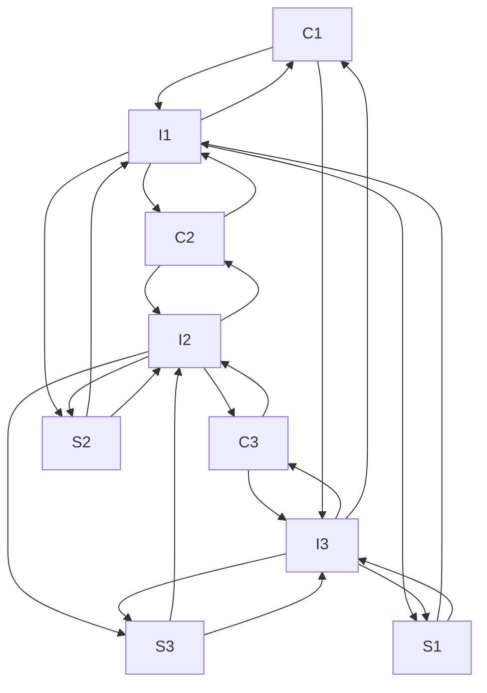

# The Intersection Problem

There is an aspect of the design that needs review. It related to the best way to implement a circular doubly-linked list which has cross links between two rings.

The clipping polygon is broken into line segments, interspersed with intersection nodes
which represent points where one polygon has crossed the other.

The clipping polygon is closed leading to a circular ring  C1->I1->C2->I2->C3->I3->C1

Similarly the subject polygon leads to sections of subject lines segments interspersed with intersections points.

S1->I1->S2->I2->S3->I3->S1

The algorithm walks over these ring structure, turning backwards and forwards or over the intersection links.





The original paper from which the clipping algorithm was developed is
[here](https://www.inf.usi.ch/hormann/papers/Greiner.1998.ECO.pdf )

Figure 10, shows two doubly-linked listed "clip" and "subject". Which can additional be characterized as having "intersection" cross links joining the two linked lists as need

From the javasript version

[rejoin.js](https://github.com/d3/d3-geo/blob/main/src/clip/rejoin.js) Intersection has next and previous pointer, (n and p ), which is the pattern of a doubly-linked list

```js
function Intersection(point, points, other, entry) {
  this.x = point;
  this.z = points;
  this.o = other; // another intersection
  this.e = entry; // is an entry?
  this.v = false; // visited
  this.n = this.p = null; // next & previous
}
```

This is what the current naive rust implementation looks like.

```rust
pub struct Intersection<'a, T>
where
    T: CoordFloat,
{
    pub x: LineElem<T>,
    pub z: Option<&'a Vec<LineElem<T>>>,
    /// Another intersection.
    pub o: Option<Rc<RefCell<Intersection<'a, T>>>>,
    /// is any entry?
    pub e: bool,
    /// visited.
    pub v: bool,

    /// Next.
    pub n: Option<Rc<RefCell<Intersection<'a, T>>>>,
    /// Previous.
    pub p: Option<Rc<RefCell<Intersection<'a, T>>>>,
}
```

Because of rusts unique ownership model, doubly-linked list must be used with care. The general recommendation is to not use them unless one has a clear set of reasoning as to why nothing else will work.

In Rust doubly-linked list are found here [std::collections::LinkedList](https://doc.rust-lang.org/std/collections/struct.LinkedList.html)

* support is experimental
* In std, functionality is limited.

 Support for doubly-linked list with insert, remove and split functionality
 can be found outside std, here [intrusive_collections::linked_list::CursorMut](intrusive_collections::linked_list::CursorMut)
